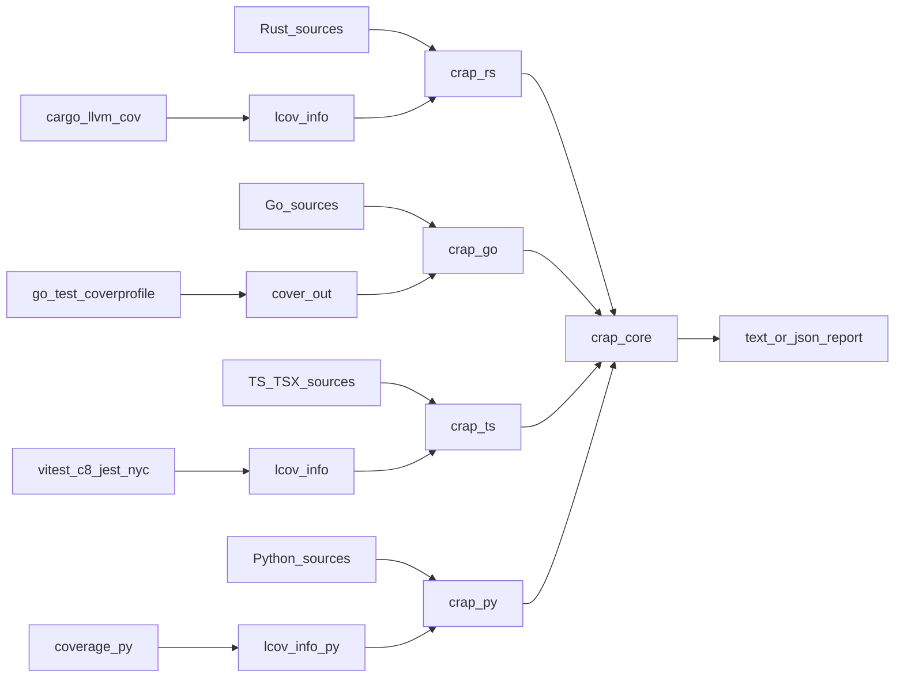
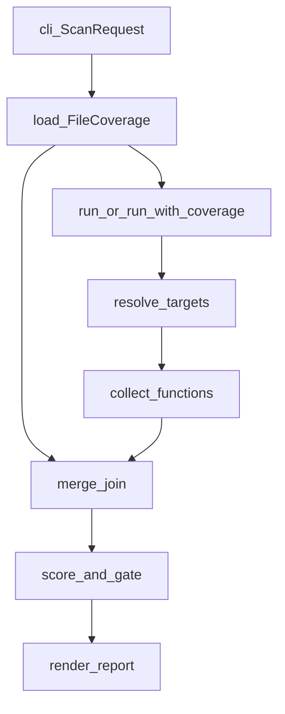
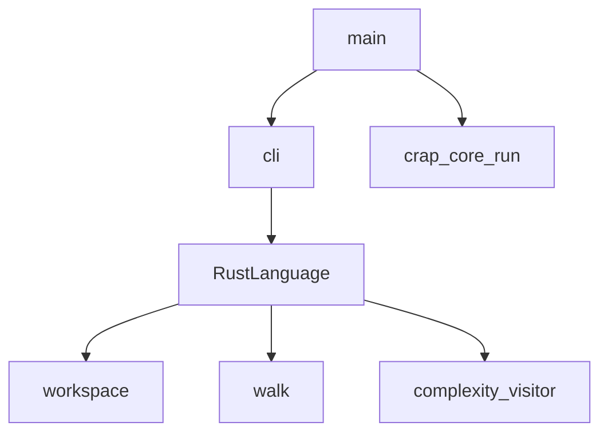
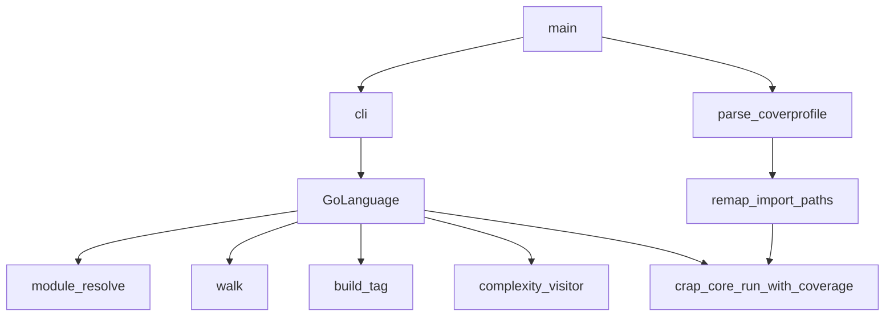
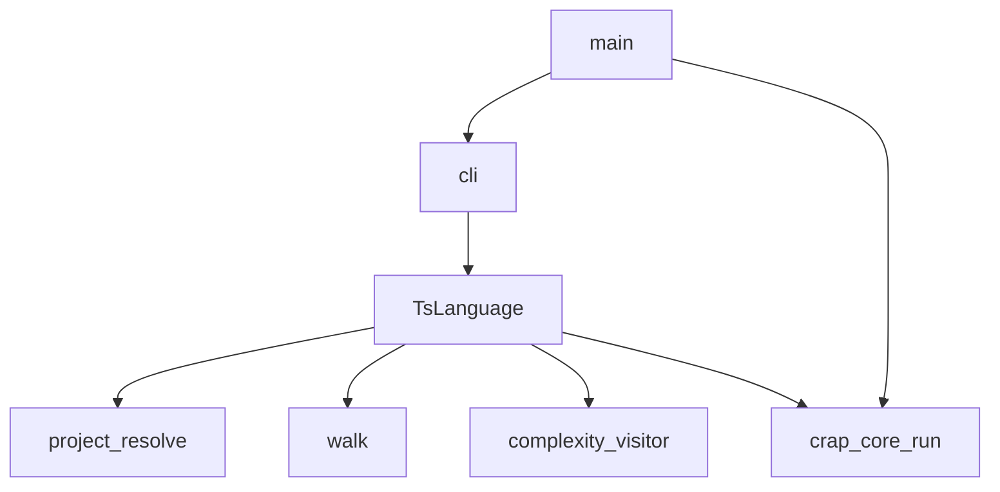

# Architecture document

This document gives the high-level system architecture of the crap-score
workspace. The workspace scores functions by combining complexity with line
coverage. The score is a **change-risk signal**: it rises when a function is
hard to follow and lightly exercised by tests. It is not a quality grade, a
programmer rating, or a management KPI.

## Purpose and scope

Agents and contributors use this file to place a change in the right crate
and to follow a run from coverage input to the report.

This file covers:

- Workspace crate roles
- End-to-end analysis flow
- `crap-core`, `crap-rs`, `crap-go`, `crap-ts`, and `crap-py` module maps
- Hard invariants
- Verification and agent layout

This file does **not** cover:

- Install steps, CLI flags, and usage examples — see [README.md](../../README.md)
- Formula, risk bands, and gate presets — see [crap-scoring](../skills/crap-scoring/SKILL.md)
- Rust visitor attribution, empty spans, and path ranking — see
  [complexity-lcov-join](../skills/complexity-lcov-join/SKILL.md)
- Go coverprofile, build tags, and visitor limits — see
  [complexity-go](../skills/complexity-go/SKILL.md)
- TypeScript LCOV, package walk, and visitor limits — see
  [complexity-ts](../skills/complexity-ts/SKILL.md)
- Python LCOV, project walk, and visitor limits — see
  [complexity-py](../skills/complexity-py/SKILL.md)
- Full local vs CI steps — see [verify](../skills/verify/SKILL.md) and
  [AGENTS.md](../../AGENTS.md)

## System context

You produce coverage with the language toolchain (`cargo llvm-cov` → LCOV,
`go test -coverprofile` → coverprofile, vitest/c8/jest/nyc → LCOV). Each
frontend reads that file and the sources, then calls `crap-core` to join,
score, and render.

- `crap-rs`, `crap-ts`, and `crap-py` use `crap_core::run`, which parses LCOV from disk.
- `crap-go` parses coverprofile in the frontend, then calls
  `crap_core::run_with_coverage` with `FileCoverage` maps.

Runtime bar:

- Rust toolchain **1.94.0** ([`rust-toolchain.toml`](../../rust-toolchain.toml))
- Virtual workspace members: `crap-core`, `crap-rs`, `crap-go`, `crap-ts`, and
  `crap-py` ([`Cargo.toml`](../../Cargo.toml))
- `crap-core` parses **LCOV only** on disk. Frontends may load a native
  format into `FileCoverage` and call `run_with_coverage`.



## Workspace crates

| Crate | Role |
| ----- | ---- |
| [`crates/crap-core`](../../crates/crap-core) | Language-agnostic LCOV parse, path join, score, risk, report, and shared CLI process helpers |
| [`crates/crap-rs`](../../crates/crap-rs) | Rust frontend: Cargo targets, source walk, complexity, and the `crap-rs` CLI |
| [`crates/crap-go`](../../crates/crap-go) | Go frontend: modules, coverprofile, complexity, and the `crap-go` CLI |
| [`crates/crap-ts`](../../crates/crap-ts) | TypeScript frontend: packages, LCOV, complexity, and the `crap-ts` CLI |
| [`crates/crap-py`](../../crates/crap-py) | Python frontend: projects, LCOV, complexity, and the `crap-py` CLI |

`crap-rs`, `crap-go`, `crap-ts`, and `crap-py` depend on `crap-core`. Each
implements [`Language`](../../crates/crap-core/src/language.rs). Rust,
TypeScript, and Python use [`crap_core::run`](../../crates/crap-core/src/run.rs);
Go uses [`crap_core::run_with_coverage`](../../crates/crap-core/src/run.rs) after
parsing coverprofile locally.

A later `crap` meta-binary could dispatch on `--lang`. The workspace does not
ship it. Exit/render I/O and argv short-circuits (`help_or_version`,
`--summary` vs JSON) live in
[`crap_core::process`](../../crates/crap-core/src/process.rs); each frontend
keeps its own clap `Args`, help text, and language-specific `run_scan`.

## High-level analysis flow

A frontend run proceeds as follows:

1. Parse argv into `ScanRequest` and the language struct
   (frontend `cli` + thin `main`; shared short-circuits via `crap_core::process`).
2. Load coverage into `HashMap<PathBuf, FileCoverage>`:
   - `crap-rs` / `crap-ts` / `crap-py`: `parse_lcov` inside `crap_core::run`
   - `crap-go`: `parse_coverprofile`, remap import-path keys via
     modules under the analysis root, then `run_with_coverage`
3. `Language::resolve_targets` selects package roots and nested skip paths.
4. `Language::collect_functions` walks sources and scores function spans.
5. `merge::join` matches source paths to coverage, applies `--missing`, and
   excludes nested function spans from the outer coverage.
6. Score each function and sort worst-first. `--fail-above` trips when any
   score is strictly above the threshold.
7. `crap_core::finish_run` renders via `report::render` (language tag
   `"rust"`, `"go"`, `"typescript"`, or `"python"`) and maps the gate to exit codes.



## `crap-core` module map

Barrel: [`crates/crap-core/src/lib.rs`](../../crates/crap-core/src/lib.rs).
Pipeline entry: [`run`](../../crates/crap-core/src/run.rs) /
[`run_with_coverage`](../../crates/crap-core/src/run.rs).

| Area | Path | Role |
| ---- | ---- | ---- |
| LCOV parse | [`coverage.rs`](../../crates/crap-core/src/coverage.rs) | `DA:` line hits → `FileCoverage`; on-disk LCOV only |
| Join | [`merge/mod.rs`](../../crates/crap-core/src/merge/mod.rs) | Function spans + coverage + `--missing` |
| Path index | [`merge/path_index.rs`](../../crates/crap-core/src/merge/path_index.rs) | Suffix ranking of coverage paths vs source paths |
| Score | [`score.rs`](../../crates/crap-core/src/score.rs) | CRAP formula, `exceeds_threshold`, `classify_risk` |
| Threshold | [`threshold.rs`](../../crates/crap-core/src/threshold.rs) | Shared `--threshold` parse (`strict` / `lenient` / number) |
| Metric | [`metric.rs`](../../crates/crap-core/src/metric.rs) | Cyclomatic or cognitive; default gate 15 |
| Language port | [`language.rs`](../../crates/crap-core/src/language.rs) | `Language`, `ScanRequest` (`coverage` path), `Target`, `ReportFormat` |
| Process | [`process.rs`](../../crates/crap-core/src/process.rs) | Shared binary exit/render I/O, `help_or_version`, `reject_summary_json` |
| Report | [`report.rs`](../../crates/crap-core/src/report.rs), [`report/json.rs`](../../crates/crap-core/src/report/json.rs) | Text table / `--summary` / JSON envelope |
| Errors | [`error.rs`](../../crates/crap-core/src/error.rs) | I/O, coverage, resolve, collect, report |

**Risk bands** (Low / Acceptable / Moderate / High) classify the score. The
**gate** (`--threshold`, `--fail-above`) is a separate pass/fail line. Do not
read a Moderate band as “exceeds threshold.” JSON `result.passed` tracks
threshold exceedances (`schema_version` 3); `gate_failed` / exit 1 still need
`--fail-above`. Detail: [crap-scoring](../skills/crap-scoring/SKILL.md).

## `crap-rs` module map

Composition: [`main.rs`](../../crates/crap-rs/src/main.rs) parses CLI, calls
`crap_core::run`, then `crap_core::finish_run` with language `"rust"`.
[`RustLanguage`](../../crates/crap-rs/src/lib.rs) implements `Language`.

| Area | Path | Role |
| ---- | ---- | ---- |
| CLI | [`cli.rs`](../../crates/crap-rs/src/cli.rs) | Flags → `ScanRequest` + `RustLanguage` (`--coverage` default `lcov.info`, alias `--lcov`) |
| Workspace | [`workspace.rs`](../../crates/crap-rs/src/workspace.rs) | `cargo metadata`, members, feature graphs |
| Walk | [`walk.rs`](../../crates/crap-rs/src/walk.rs) | `.rs` files; skip `target` / `.git`; package-root `tests` / `benches` / `examples`; nested members |
| Visitor | [`complexity/visitor.rs`](../../crates/crap-rs/src/complexity/visitor.rs) | Function spans and names |
| Cyclomatic | [`complexity/cyclomatic.rs`](../../crates/crap-rs/src/complexity/cyclomatic.rs) | Decision-point count |
| Cognitive | [`complexity/cognitive.rs`](../../crates/crap-rs/src/complexity/cognitive.rs) | Nesting-weighted count |
| Cfg | [`complexity/cfg_filter.rs`](../../crates/crap-rs/src/complexity/cfg_filter.rs) | Host and feature `#[cfg]` |



## `crap-go` module map

Composition: [`main.rs`](../../crates/crap-go/src/main.rs) parses CLI, parses
coverprofile, remaps import-path keys via modules under the analysis root,
calls `crap_core::run_with_coverage`, then `crap_core::finish_run` with
language `"go"`.
[`GoLanguage`](../../crates/crap-go/src/lib.rs) implements `Language`. The
analyzer is Rust-only; no Go toolchain and no tree-sitter.

| Area | Path | Role |
| ---- | ---- | ---- |
| CLI | [`cli.rs`](../../crates/crap-go/src/cli.rs) | Flags → `ScanRequest` + `GoLanguage` (`--coverage` default `cover.out`) |
| Coverprofile | [`coverprofile.rs`](../../crates/crap-go/src/coverprofile.rs) | Go coverprofile → `FileCoverage`; remap import paths via `go.mod` |
| Module resolve | [`module_resolve.rs`](../../crates/crap-go/src/module_resolve.rs) | `go.mod` packages, enclosing module, and nested module skips |
| Walk | [`walk.rs`](../../crates/crap-go/src/walk.rs) | `.go` files; skip `vendor`, `.git`, `testdata`, nested modules |
| Build tags | [`build_tag.rs`](../../crates/crap-go/src/build_tag.rs) | Leading `//go:build` / `// +build` skip |
| Visitor | [`complexity/visitor.rs`](../../crates/crap-go/src/complexity/visitor.rs) | Named funcs / methods and body spans |
| Cyclomatic | [`complexity/cyclomatic.rs`](../../crates/crap-go/src/complexity/cyclomatic.rs) | Decision-point count |
| Cognitive | [`complexity/cognitive.rs`](../../crates/crap-go/src/complexity/cognitive.rs) | Nesting-weighted count |



Detail: [complexity-go](../skills/complexity-go/SKILL.md).

## `crap-ts` module map

Composition: [`main.rs`](../../crates/crap-ts/src/main.rs) parses CLI, calls
`crap_core::run`, then `crap_core::finish_run` with language `"typescript"`.
[`TsLanguage`](../../crates/crap-ts/src/lib.rs) implements `Language`. The
analyzer is Rust-only; no Node toolchain and no tree-sitter.

| Area | Path | Role |
| ---- | ---- | ---- |
| CLI | [`cli.rs`](../../crates/crap-ts/src/cli.rs) | Flags → `ScanRequest` + `TsLanguage` (`--coverage` default `lcov.info`) |
| Project resolve | [`project_resolve/`](../../crates/crap-ts/src/project_resolve/mod.rs) | `package.json` packages and workspace globs |
| Walk | [`walk.rs`](../../crates/crap-ts/src/walk.rs) | `.ts` / `.tsx`; skip `node_modules`, `.git`, `dist`, `build`, `coverage`, nested packages |
| Visitor | [`complexity/visitor.rs`](../../crates/crap-ts/src/complexity/visitor.rs) | Named funcs / methods / brace-bodied arrows and body spans |
| Cyclomatic | [`complexity/cyclomatic.rs`](../../crates/crap-ts/src/complexity/cyclomatic.rs) | Decision-point count |
| Cognitive | [`complexity/cognitive.rs`](../../crates/crap-ts/src/complexity/cognitive.rs) | Nesting-weighted count |



Detail: [complexity-ts](../skills/complexity-ts/SKILL.md).

## `crap-py` module map

Composition: [`main.rs`](../../crates/crap-py/src/main.rs) parses CLI, calls
`crap_core::run`, then `crap_core::finish_run` with language `"python"`.
[`PyLanguage`](../../crates/crap-py/src/lib.rs) implements `Language`. The
analyzer is Rust-only; no Python runtime and no tree-sitter.

| Area | Path | Role |
| ---- | ---- | ---- |
| CLI | [`cli.rs`](../../crates/crap-py/src/cli.rs) | Flags → `ScanRequest` + `PyLanguage` (`--coverage` default `lcov.info`) |
| Project resolve | [`project_resolve/`](../../crates/crap-py/src/project_resolve/mod.rs) | `pyproject.toml` projects and uv workspace globs |
| Walk | [`walk.rs`](../../crates/crap-py/src/walk.rs) | `.py`; skip venvs / caches / nested projects |
| Visitor | [`complexity/visitor.rs`](../../crates/crap-py/src/complexity/visitor.rs) | Named defs / methods and indent suites |
| Cyclomatic | [`complexity/cyclomatic.rs`](../../crates/crap-py/src/complexity/cyclomatic.rs) | Decision-point count |
| Cognitive | [`complexity/cognitive.rs`](../../crates/crap-py/src/complexity/cognitive.rs) | Nesting-weighted count |


Detail: [complexity-py](../skills/complexity-py/SKILL.md).

## Hard invariants

| Invariant | Why |
| --------- | --- |
| `crap-core` parses LCOV only on disk; native formats enter via `run_with_coverage` | One on-disk parser; frontends own format adapters |
| Frontends implement `Language`; scoring stays in `crap-core` | A language crate must not fork the formula |
| Risk bands never change the gate | Labels classify; `--fail-above` decides pass/fail |
| Empty spans and missing paths use `--missing` | Do not treat a missing join as 100% coverage |
| Workspace members are `crap-core`, `crap-rs`, `crap-go`, `crap-ts`, and `crap-py` only | Do not add `cargo-crap` or other on-disk leftovers |
| No `#[allow]`; use `#[expect(..., reason = "...")]` | Matches workspace lints; see [rust-style-guide](../skills/rust-style-guide/SKILL.md) |

## Exit codes

| Code | Meaning |
| ---- | ------- |
| `0` | Analysis finished; the gate did not trip |
| `1` | Analysis finished; `--fail-above` tripped |
| `2` | Usage, I/O, metadata, collect, or report error. Unreadable or structurally invalid source is a collect error: one failed file aborts the whole run for Rust, Go, TypeScript, and Python. JSON serialize failures are a report error. |

Flag reference: [README.md](../../README.md).

## Trust boundary

These CLIs are local analysis tools. They do not open network sockets or
execute untrusted code. Walk follows file and directory symlinks only when
the resolved target stays under the walk root; cycles and out-of-root links
are skipped. Residual risk is local filesystem access under the chosen
`--path`, not remote code execution.

## Verification and agent layout

Full local vs CI (fmt, Clippy, deny, audit, test, rustdoc, 100% lines, CRAP
`--threshold strict`):

```bash
./scripts/check.sh
```

Then the coverage gates in [verify](../skills/verify/SKILL.md), or run
`/verify`. The stop hook runs the same procedure on relevant dirty trees.

Agent support lives under `.agents/`:

- `docs/` — this architecture file
- `skills/` — verify, scoring, LCOV join, Go frontend, Rust style, SOLID
- `commands/` — `/verify`, `/audit-rust-skills`
- `rules/` — agent standards and metric hotspots
- `hooks/` — rustfmt after edit; session context; verify on stop

See [AGENTS.md](../../AGENTS.md) for the full index.
