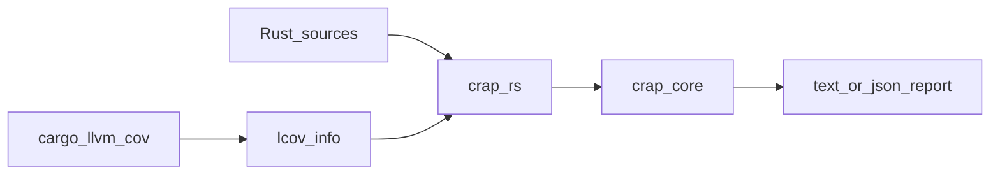
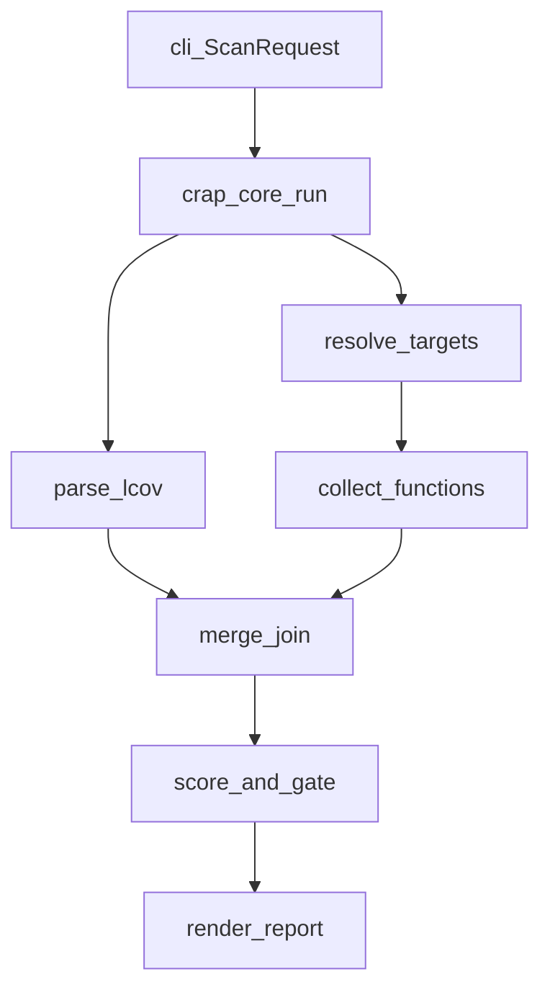
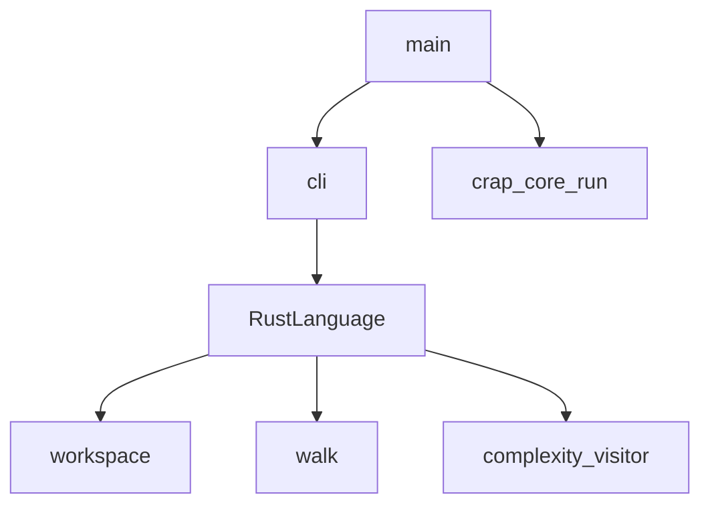

# Architecture document

This document gives the high-level system architecture of the crap-analyzer
workspace. The workspace scores Rust functions by combining complexity with
LCOV line coverage. The score is a **change-risk signal**: it rises when a
function is hard to follow and lightly exercised by tests. It is not a quality
grade, a programmer rating, or a management KPI.

## Purpose and scope

Agents and contributors use this file to place a change in the right crate
and to follow a run from LCOV to the report.

This file covers:

- Workspace crate roles
- End-to-end analysis flow
- `crap-core` and `crap-rs` module maps
- Hard invariants
- Verification and agent layout

This file does **not** cover:

- Install steps, CLI flags, and usage examples — see [README.md](../../README.md)
- Formula, risk bands, and gate presets — see [crap-scoring](../skills/crap-scoring/SKILL.md)
- Visitor attribution, empty spans, and path ranking — see
  [complexity-lcov-join](../skills/complexity-lcov-join/SKILL.md)
- Full local vs CI steps — see [verify](../skills/verify/SKILL.md) and
  [AGENTS.md](../../AGENTS.md)

## System context

You produce LCOV with `cargo llvm-cov`. The `crap-rs` binary reads that file
and the Rust sources, then calls `crap-core` to join, score, and render.

Runtime bar:

- Rust toolchain **1.94.0** ([`rust-toolchain.toml`](../../rust-toolchain.toml))
- Virtual workspace members: `crap-core` and `crap-rs` only
  ([`Cargo.toml`](../../Cargo.toml))
- Coverage input is **LCOV only**. Convert other formats first. Do not add a
  second parser.



## Workspace crates

| Crate | Role |
| ----- | ---- |
| [`crates/crap-core`](../../crates/crap-core) | Language-agnostic LCOV parse, path join, score, risk, and report |
| [`crates/crap-rs`](../../crates/crap-rs) | Rust frontend: Cargo targets, source walk, complexity, and the `crap-rs` CLI |

`crap-rs` depends on `crap-core`. A later language crate (`crap-go`,
`crap-ts`) would implement [`Language`](../../crates/crap-core/src/language.rs)
and call [`crap_core::run`](../../crates/crap-core/src/run.rs). That crate is
not in this workspace.

A later `crap` meta-binary could dispatch on `--lang`. The workspace does not
ship it.

## High-level analysis flow

A `crap-rs` run proceeds as follows:

1. Parse argv into `ScanRequest` and `RustLanguage`
   ([`cli`](../../crates/crap-rs/src/cli.rs),
   [`main`](../../crates/crap-rs/src/main.rs)).
2. `parse_lcov` builds per-file line-hit maps.
3. `Language::resolve_targets` selects package roots and nested skip paths.
4. `Language::collect_functions` walks `.rs` files, applies `#[cfg]`, and
   scores function spans.
5. `merge::join` matches source paths to LCOV, applies `--missing`, and
   excludes nested function spans from the outer coverage.
6. Score each function and sort worst-first. `--fail-above` trips when any
   score is strictly above the threshold.
7. `report::render` writes a text table or a JSON envelope.



## `crap-core` module map

Barrel: [`crates/crap-core/src/lib.rs`](../../crates/crap-core/src/lib.rs).
Pipeline entry: [`run`](../../crates/crap-core/src/run.rs).

| Area | Path | Role |
| ---- | ---- | ---- |
| LCOV parse | [`coverage.rs`](../../crates/crap-core/src/coverage.rs) | `DA:` line hits per source file |
| Join | [`merge/mod.rs`](../../crates/crap-core/src/merge/mod.rs) | Function spans + coverage + `--missing` |
| Path index | [`merge/path_index.rs`](../../crates/crap-core/src/merge/path_index.rs) | Suffix ranking of LCOV `SF:` vs source paths |
| Score | [`score.rs`](../../crates/crap-core/src/score.rs) | CRAP formula, `exceeds_threshold`, `classify_risk` |
| Metric | [`metric.rs`](../../crates/crap-core/src/metric.rs) | Cyclomatic or cognitive; default gate 15 |
| Language port | [`language.rs`](../../crates/crap-core/src/language.rs) | `Language`, `ScanRequest`, `Target`, `ReportFormat` |
| Report | [`report.rs`](../../crates/crap-core/src/report.rs), [`report/json.rs`](../../crates/crap-core/src/report/json.rs) | Text table / `--summary` / JSON envelope |
| Errors | [`error.rs`](../../crates/crap-core/src/error.rs) | I/O, coverage, resolve, collect |

**Risk bands** (Low / Acceptable / Moderate / High) classify the score. The
**gate** (`--threshold`, `--fail-above`) is a separate pass/fail line. Do not
read a Moderate band as “exceeds threshold.” Detail:
[crap-scoring](../skills/crap-scoring/SKILL.md).

## `crap-rs` module map

Composition: [`main.rs`](../../crates/crap-rs/src/main.rs) parses CLI, calls
`crap_core::run`, then `render`.
[`RustLanguage`](../../crates/crap-rs/src/lib.rs) implements `Language`.

| Area | Path | Role |
| ---- | ---- | ---- |
| CLI | [`cli.rs`](../../crates/crap-rs/src/cli.rs) | Flags → `ScanRequest` + `RustLanguage` |
| Workspace | [`workspace.rs`](../../crates/crap-rs/src/workspace.rs) | `cargo metadata`, members, feature graphs |
| Walk | [`walk.rs`](../../crates/crap-rs/src/walk.rs) | `.rs` files; skip `tests`, `target`, convention dirs, nested members |
| Visitor | [`complexity/visitor.rs`](../../crates/crap-rs/src/complexity/visitor.rs) | Function spans and names |
| Cyclomatic | [`complexity/cyclomatic.rs`](../../crates/crap-rs/src/complexity/cyclomatic.rs) | Decision-point count |
| Cognitive | [`complexity/cognitive.rs`](../../crates/crap-rs/src/complexity/cognitive.rs) | Nesting-weighted count |
| Cfg | [`complexity/cfg_filter.rs`](../../crates/crap-rs/src/complexity/cfg_filter.rs) | Host and feature `#[cfg]` |



## Hard invariants

| Invariant | Why |
| --------- | --- |
| LCOV is the only coverage format | One parser; other tools convert first |
| Frontends implement `Language`; scoring stays in `crap-core` | A second language crate must not fork the formula |
| Risk bands never change the gate | Labels classify; `--fail-above` decides pass/fail |
| Empty spans and missing paths use `--missing` | Do not treat a missing join as 100% coverage |
| Workspace members are `crap-core` and `crap-rs` only | Do not add `cargo-crap` or other on-disk leftovers |
| No `#[allow]`; use `#[expect(..., reason = "...")]` | Matches workspace lints; see [rust-style-guide](../skills/rust-style-guide/SKILL.md) |

## Exit codes

| Code | Meaning |
| ---- | ------- |
| `0` | Analysis finished; the gate did not trip |
| `1` | Analysis finished; `--fail-above` tripped |
| `2` | Usage, I/O, metadata, or collect error. Any unparseable source file is a collect error. |

Flag reference: [README.md](../../README.md).

## Verification and agent layout

Full local vs CI (fmt, Clippy, deny, audit, test, rustdoc, 100% lines, CRAP
`--threshold strict`):

```bash
./scripts/check.sh
```

Then the coverage gates in [verify](../skills/verify/SKILL.md), or run
`/verify`. The stop hook runs the same procedure on relevant dirty trees.

Agent support lives under `.agents/`:

- `docs/` — this architecture file
- `skills/` — verify, scoring, LCOV join, Rust style, SOLID
- `commands/` — `/verify`, `/audit-rust-skills`
- `rules/` — agent standards and metric hotspots
- `hooks/` — rustfmt after edit; session context; verify on stop

See [AGENTS.md](../../AGENTS.md) for the full index.
